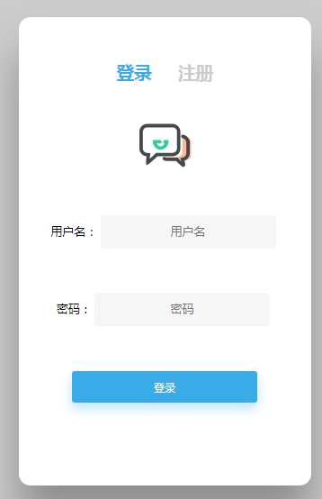
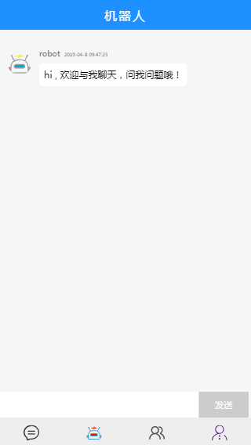
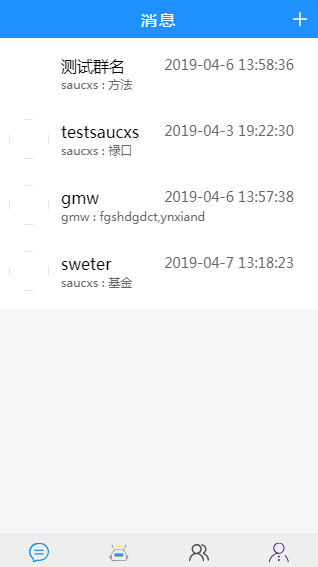
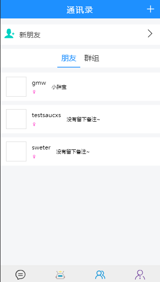
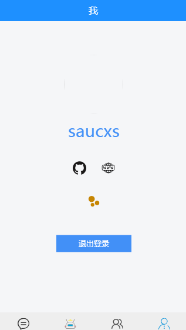

# [happyChatApp](https://github.com/saucxs/happyChatApp)
[](https://github.com/saucxs/happyChatApp)
[](https://github.com/saucxs/happyChatApp/blob/master/LICENSE)
[](https://github.com/saucxs/happyChatApp/stargazers)
[](https://github.com/saucxs/happyChatApp/network)
[](https://github.com/saucxs/happyChatApp/issues)

乐聊，一个快乐聊天的应用，支持pc端和无线端和安卓APP。

（1）PC端和无线端线上地址：http://chat.chengxinsong.cn

（2）下载安卓APP地址：暂时不提供，在优化和安全测试中

## 1、功能
+ 版本v 1.0.0
    - 1、支持注册用户和邮件激活用户；
    - 2、支持登陆
    - 3、支持机器人聊天；
    - 4、支持加好友，一对一聊天；
    - 5、支持创建群，加群，一对多聊天；
    - 6、支持删除好友，退出群
    - 7、支持个人信息编辑
    - 8、支持添加好友备注
    - 9、支持聊天中文字发送
    - 10、支持浏览器：Chrome，Firefox，Safari，IE9及以上； 

+ 版本v 1.1.0
    - 1、支持聊天中图片发送
    - 2、支持聊天中表情发送
    - 待续
    
    
## 2、PC端和无线端线上地址

http://chat.chengxinsong.cn

## 3、安卓下载地址

在优化和安全测试中，暂时不提供
    
## 3、源码使用
```js
git clone https://github.com/saucxs/happyChatApp.git

cd happyChatApp

npm i

cordova run android
```

## 4、截图

登陆




机器人



消息列表



通讯录



个人信息



等等

## 5、前后端源码地址

无线端和PC端前端代码：https://github.com/saucxs/happy-chat-web

安卓APP代码：https://github.com/saucxs/happyChatApp

后端代码：https://github.com/saucxs/happy-chat-node

## 6、最后

欢迎fork和star，有问题提issue
